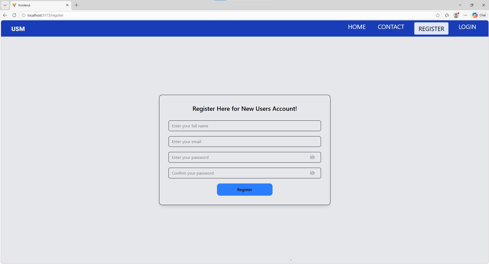
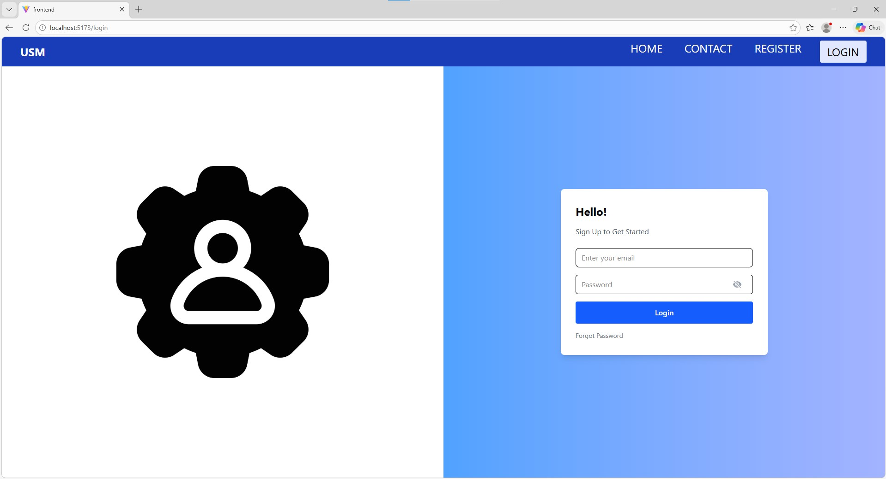
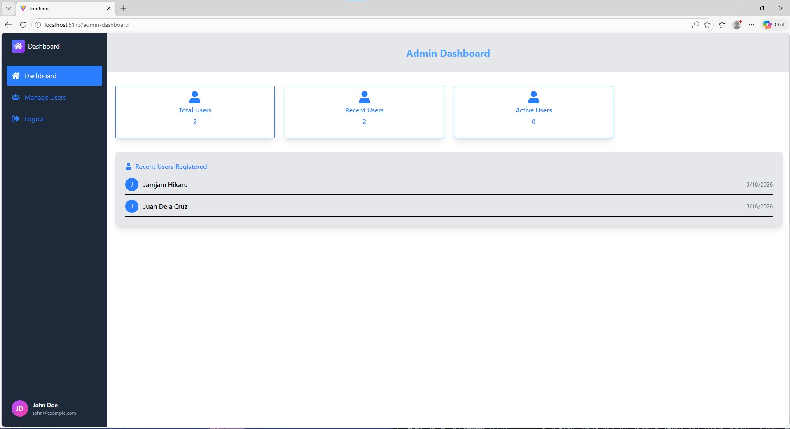
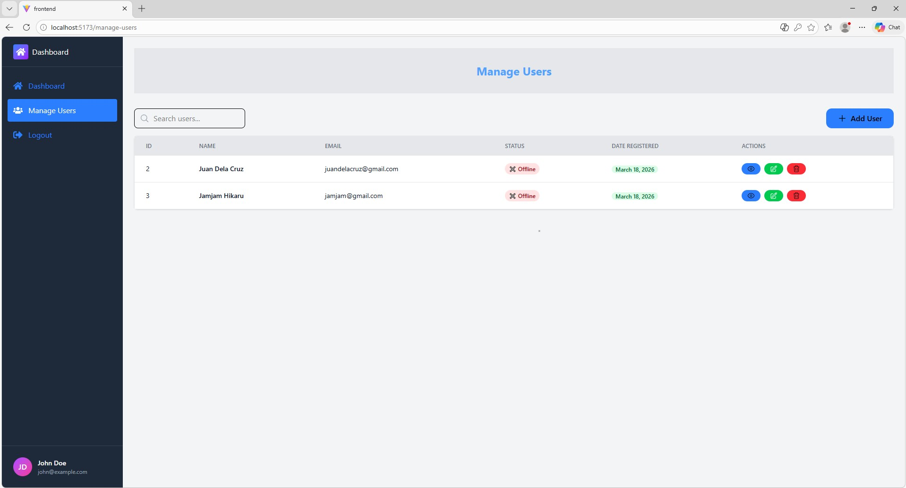
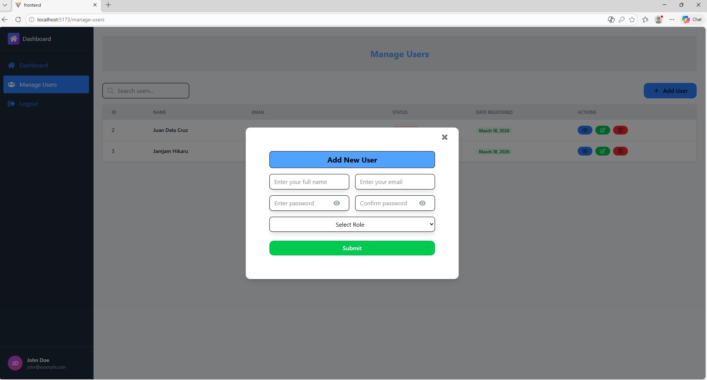
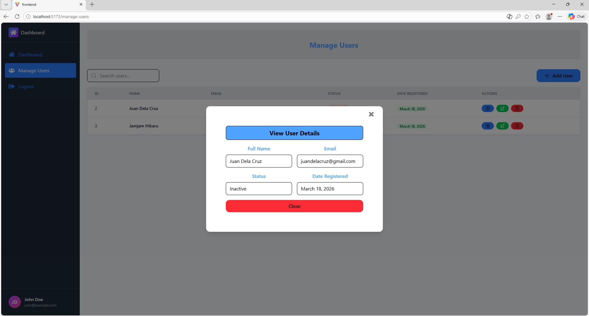
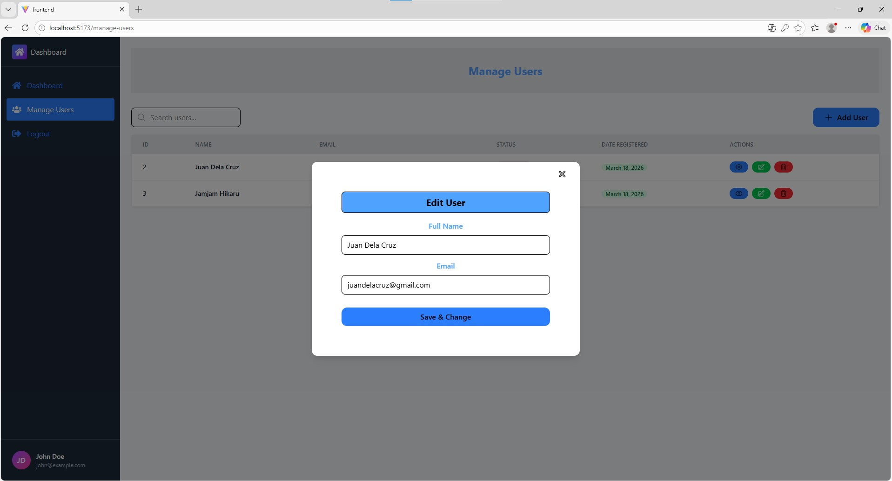
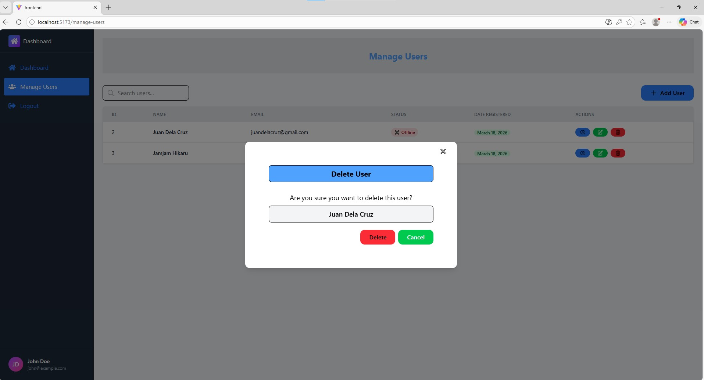

# 🚀 Users Management System (USM)

A full-stack Users Management System built using modern web technologies.
This project allows user authentication, management, and secure data handling using JWT and password hashing.

---

## 📸 Screenshots

### 📝 Register User



### 🔐 Login Page



### 📊 Dashboard



### 📋 Admin Users Table



## 🔄 CRUD Operations

### ➕ Add User Modal



### ➕ View User Modal



### ➕ Update User Modal



### ➕ Delete User Modal



---

## 🛠 Tech Stack

### 🎨 Frontend

- React JS (Vite)
- Tailwind CSS
- Axios

### ⚙️ Backend

- Node.js
- Express.js
- CORS
- Dotenv
- JSON Web Token (JWT)
- bcrypt

### 🗄 Database

- MySQL (mysql2)

---

## ✨ Features

- 🔐 User Authentication (Login & Register)
- 🔑 Secure Password Hashing using bcrypt
- 🎟 JWT-based Authentication
- 📋 CRUD Operations (Create, Read, Update, Delete Users)
- 🌐 RESTful API Integration
- ⚡ Fast Frontend with Vite

---

## 📂 Project Structure

```
USM/
│
├── frontend/      # React + Vite
├── backend/       # Node + Express API
```

---

## 🚀 Installation & Setup

### Clone the Repository

```bash
git clone https://github.com/edilbertogalang22/Simple-Crud.git
cd Simple-Crud
```

---

### Setup Frontend

```bash
cd frontend
npm install
npm run dev
```

Frontend will run on:
👉 http://localhost:5173

---

### Setup Backend

```bash
cd backend
npm start
```

Backend will run on:
👉 http://localhost:5000

---

### Environment Variables

Create a `.env` file inside the **backend** folder:

```env
PORT=5000
DB_HOST=localhost
DB_USER=root
DB_PASSWORD=
DB_PORT=3306
DB_NAME=ums_db
JWT_SECRET=secret12345
```

---

## 🗄 Database Setup

1. Open MySQL
2. Create a database:

```sql
CREATE DATABASE ums_db;
```

3. Run this SQL:

```sql
CREATE TABLE `users` (
  `id` int(11) NOT NULL AUTO_INCREMENT,
  `fullname` varchar(225) NOT NULL,
  `email` varchar(225) NOT NULL,
  `password` varchar(225) NOT NULL,
  `user_type` tinyint(4) DEFAULT 2,
  `created_at` datetime NOT NULL DEFAULT current_timestamp(),
  `status` tinyint(4) DEFAULT 0,
  PRIMARY KEY (`id`),
  UNIQUE KEY `email` (`email`)
);

INSERT INTO `users` (`fullname`, `email`, `password`, `user_type`, `status`) VALUES
('Admin User', 'admin@gmail.com', 'hashed_password_here', 1, 1);
```

## 🔗 API Sample Endpoints

| Method | Endpoint   | Description   |
| ------ | ---------- | ------------- |
| POST   | /register  | Register user |
| POST   | /login     | Login user    |
| GET    | /users     | Get all users |
| PUT    | /users/:id | Update user   |
| DELETE | /users/:id | Delete user   |

## 👨‍💻 Author

**Edilberto Galang**
GitHub: https://github.com/edilbertogalang22

---

## ⭐ Support

If you like this project, give it a ⭐ on GitHub!
